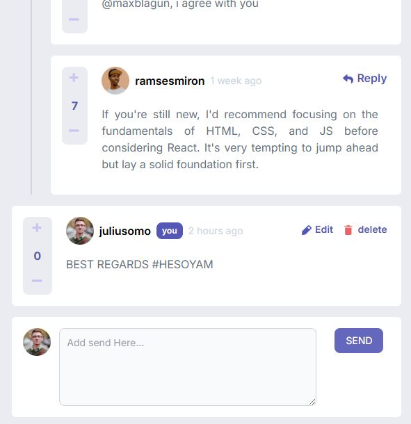

# Frontend Mentor - Interactive comments section solution

This is a solution to the [Interactive comments section challenge on Frontend Mentor](https://www.frontendmentor.io/challenges/interactive-comments-section-iG1RugEG9). Frontend Mentor challenges help you improve your coding skills by building realistic projects. 

## Table of contents

- [Overview](#overview)
  - [The challenge](#the-challenge)
  - [Screenshot](#screenshot)
  - [Links](#links)
- [My process](#my-process)
  - [Built with](#built-with)
  - [What I learned](#what-i-learned)
- [Author](#author)
- [Acknowledgments](#acknowledgments)

**Note: Delete this note and update the table of contents based on what sections you keep.**

## Overview

### The challenge

Users should be able to:

- View the optimal layout for the app depending on their device's screen size
- See hover states for all interactive elements on the page
- Create, Read, Update, and Delete comments and replies
- Upvote and downvote comments
- If you're building a purely front-end project, use `localStorage` to save the current state in the browser that persists when the browser is refreshed.
- Instead of using the `createdAt` strings from the `data.json` file, try using timestamps and dynamically track the time since the comment or reply was posted.

### Screenshot



This is preview of my design which intractive comment with HTML and vanilla JavaScript


### Links

- Solution URL: [Add solution URL here](https://your-solution-url.com)
- Live Site URL: [Add live site URL here](https://your-live-site-url.com)

## My process

### Built with

- Semantic HTML5 markup
- CSS custom properties
- Flexbox
- CSS Grid
- Mobile-first workflow
- Tailwindcss


### What I learned

this is first time for me to impelement Immediately Invoke Function

```js
(async function runFunction(){
  try{
      if(localStorage.getItem('user') ==null)await loadData();
      readData();
})()
```


## Author

- Frontend Mentor - [@boyhendrawan](https://www.frontendmentor.io/profile/boyhendrawan)
- LINKEID - [@Boy Hendrawan](https://www.linkedin.com/in/boy-hendrawan-purba-948705157/)

**Note: Delete this note and add/remove/edit lines above based on what links you'd like to share.**

## Acknowledgments

according to me this challange really easy to solve using some library like React or others framework Front end but if you want to improve your skill with native it possible to use vanilla JS
